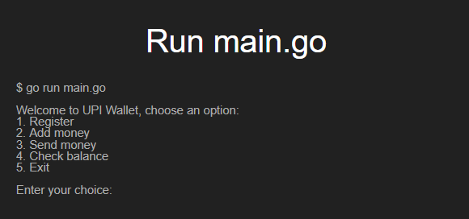

# UPI Wallet using Go

# Introduction:

It's a command-line payment application written in Go. It provides users with a simple yet powerful interface to manage their transactions, send money to other users, receive money from other users and check balance.

# How to use it:

Please ensure you have Go installed on your system. If not, download and install Go from here.

```sh 
https://go.dev/dl/ 

``` 


# Clone the repo

```sh 
https://github.com/sarkarbikram90/UPI-Wallet.git 

```

```sh 
cd UPI-Wallet 
```

```sh 
go run main.go 
```

# Make it executable

```sh 
go build 
```

# An user can perform the following operations


# Register 
#### This will allow an user to create a wallet with user details such as Name, Mobile number, Bank account number and UPI PIN


# Features:

# Account Management:

Users can create accounts by providing their Profile details, such as name, phone number, bank account number and UPI PIN.

# Transaction Handling:

# Users can following operations

1. Send money to other users.
2. Receive money from other uers.
3. Check balance after adding money.
4. Check balance after sending money.
5. Check balance after receiving money.


##### Register User:
1. Name
2. Mobile Number
3. Bank Account Number
4. UPI PIN

License: This project is licensed under the MIT License.
